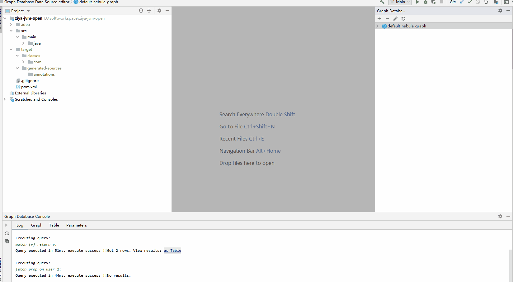

# [Nebula Graph Database support](https://github.com/awang12345/nebula-console-for-idea)
[](https://travis-ci.org/awang12345/nebula-console-for-idea)

<a href="https://github.com/nebula-contrib/nebula-console-intellij-plugin">#English</a> |  #中文

## 在 [IntelliJ IDEA](http://plugins.jetbrains.com/plugin/6317-lombok-plugin) 中用上 [Nebula-Console](https://docs.nebula-graph.com.cn/3.6.0/nebula-console/) 的插件
___

- 在 IntelliJ IDEA 上提供控制台功能用来管理 NebulaGraph 的数据

本插件由 [awang12345](http://awang12345.github.io/) 开发和提供技术支持，如果你有意向一同发展本插件，记得 issue 区和我交流下。



由于 [Neueda Technologies](http://technologies.neueda.com/) 开发的 [Graph Database Support](https://github.com/neueda/jetbrains-plugin-graph-database-support) 插件已经有段时间没有更新，也不支持 NebulaGraph。所以，基于这个插件我做了二次的开发，适配了 NebulaGraph。

## 特性
___
- 适配 **任意一款** Jetbrains IDE
- 管理数据源
- 写查询、执行查询语句
- 在 “table view” 界面探索查询结果
- 在 “graph view” 界面可视化探索查询结果
- 支持的数据库：
  - Neo4j 3.4+ (Bolt)
  - Nebula 3.0+ (Thrift)
- 查询语言 [nGQL](https://docs.nebula-graph.com.cn/3.6.0/3.ngql-guide/1.nGQL-overview/1.overview/) 的支持程度：
    - 可解析 `.ngql` 文件中的查询
    - 语法高亮
    - 自动补全 [nebula-graph](https://www.nebula-graph.com.cn)、[nebula-java](https://docs.nebula-graph.com.cn/3.6.0/14.client/4.nebula-java-client) 中的标识符、关键字、图空间、Tag、边等等信息
- 查询语言 [Cypher](https://github.com/opencypher/openCypher) 的支持程度:
  - 可解析 `.cyp`、`.cypher`、`.cql` 等文件中的查询
  - 语法高亮和报错
  - 重构对标识符、Label、Relationship 类型、属性的支持
  - 从现有查询和配置的数据源中收集信息，实现标识符、Label、Relationship 类型、属性、函数和存储过程的自动补全
  - 代码格式化
  - 提供函数、存储过程的文档
  - 检查项：数据库告警、函数检查、类型系统。

## 如何使用
___

1. 安装插件
   * 方法 1：在 [Jetbrains Plugin Marketing](https://plugins.jetbrains.com/plugin/23470) 搜索“Nebula Graph”
   * 方法 2：在本仓库 [release](https://github.com/nebula-contrib/nebula-console-intellij-plugin/releases) 页面下载插件的最新发行版，并完成手动安装
2. 在 IDEA IDE 的侧边栏工具窗口中找到 "" 的菜单。
3. 点击 "+" 添加一个图数据库配置，并验证连接是否有效。
4. 点击 "" 按钮刷新数据库的元数据.
5. 双击根节点（数据源名称）打开图查询语言编辑器面板。
6. 在面板编辑查询语句，右键点击并选择 “Run” 或是点击 "" 按钮运行查询语句。
7. 查询结果将显示在编辑面板下方的控制台中，“**log**” 表格显示具体的执行日志信息，“**table**” 表格显示执行结果信息。

## 所支持的 Jetbrains 产品
___
* IntelliJ Idea 2019.1+
* RubyMine
* WebStorm
* PhpStorm
* PyCharm
* AppCode
* Android Studio
* Datagrip
* CLion

## 开发环境
___

⚠️：需将本地环境切换到 JDK 11；

采用 Gradle 作为构建系统：

``` 构建和运行
# Build plugin distribution
./gradlew buildPlugin

# 开发模式运行 ide
./gradlew :graph-database-support-plugin:runIde
```
